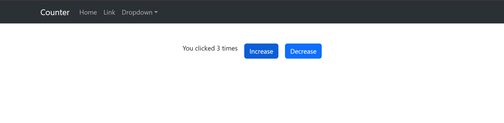

# React Counter App

## 📌 Overview
This is a simple React application that includes a counter with increment and decrement functionality using React state. The app uses React Bootstrap for styling and includes a navigation bar.



## 🚀 Features
- A **Navbar** component built using React-Bootstrap.
- A **Counter System** where:
  - Clicking the **Increase** button increments the counter.
  - Clicking the **Decrease** button decrements the counter.
- Bootstrap styling for responsiveness and aesthetics.

## 🛠 Technologies Used
- **React** (Functional Components, Hooks)
- **React Bootstrap** for UI styling

## 📂 Project Structure
```
/your-project-root
│── /src
│   ├── /components
│   │   ├── ButtonInput.jsx
│   │   ├── NavBar.jsx
|   |   ├── Counter.jsx
│   ├── App.jsx
├── index.js
│── package.json
│── README.md
```

## 📜 Installation & Setup
1. **Clone the repository:**
   ```sh
   git clone https://github.com/Ayat166/React_Day2.git
   cd React-Day2
   ```
2. **Install dependencies:**
   ```sh
   npm install
   ```
3. **Start the development server:**
   ```sh
   npm start
   ```


## 🤝 Contributing
Feel free to fork this repo and submit a PR with improvements! 🚀

## 📜 License
This project is **MIT Licensed**.

---
Happy Coding! 🎉

